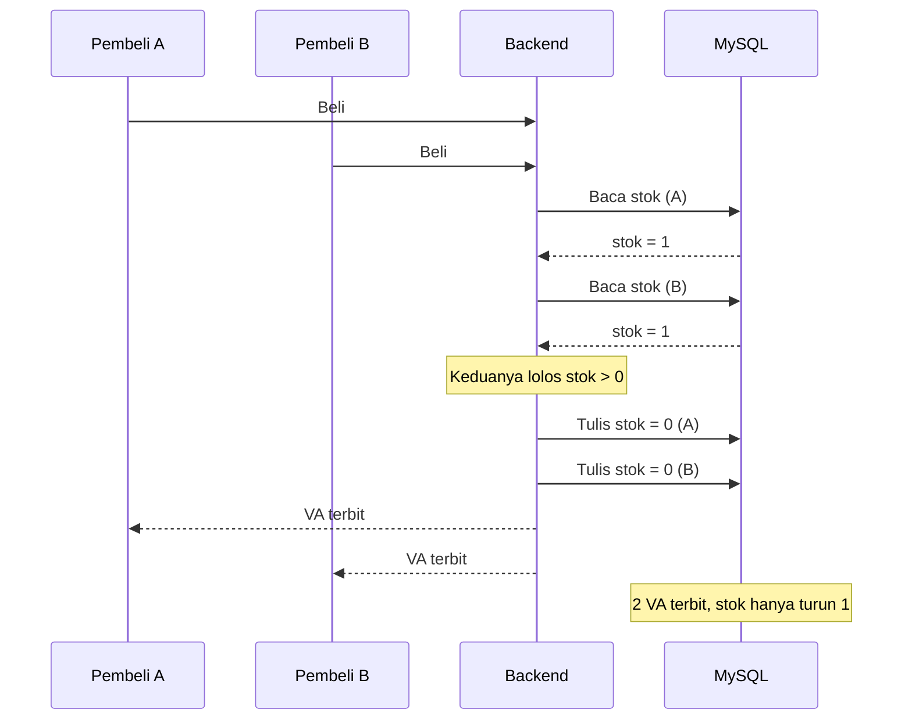
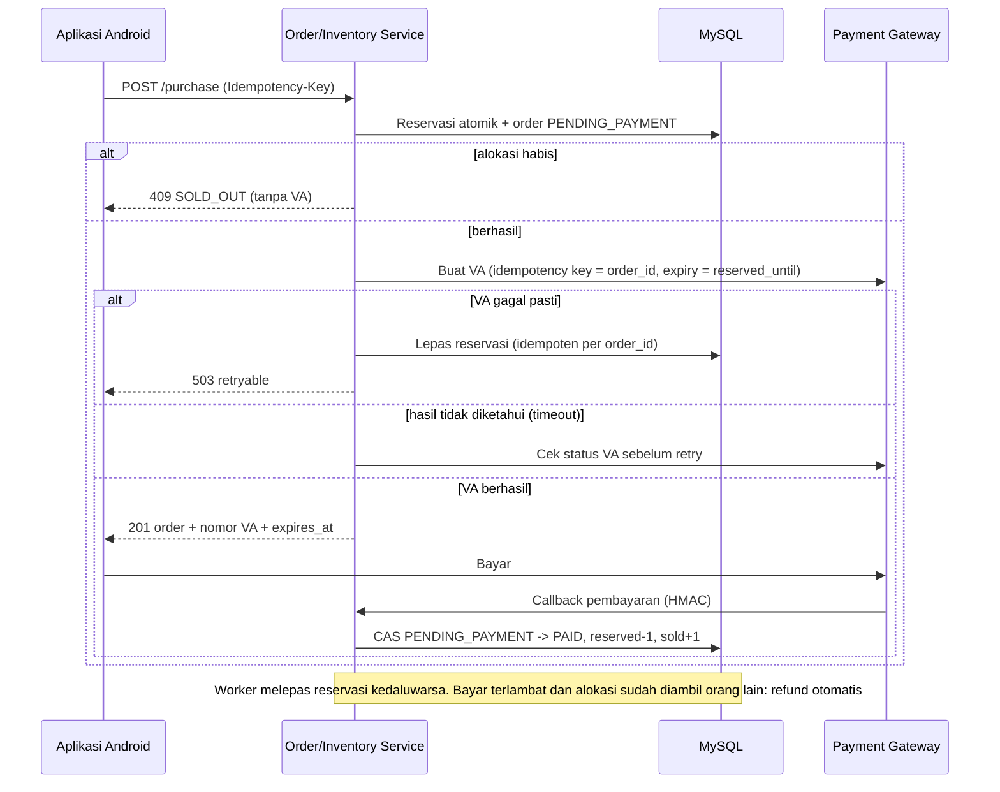
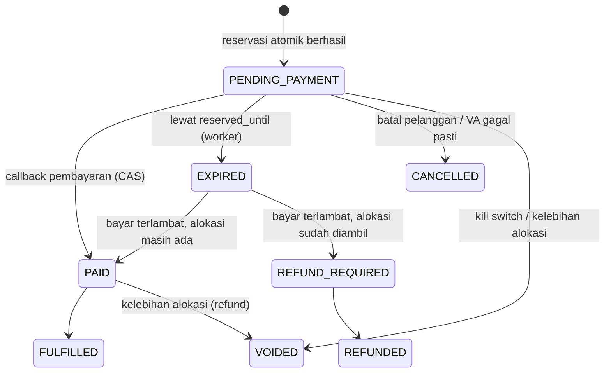
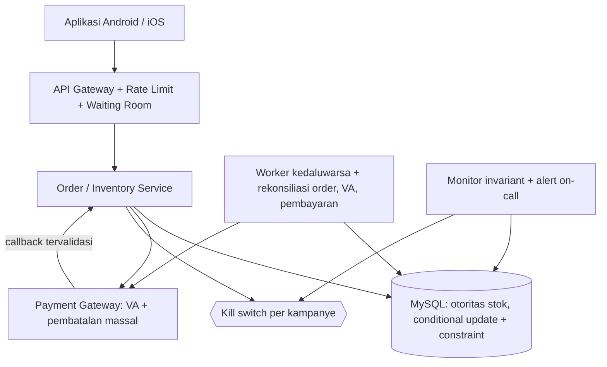
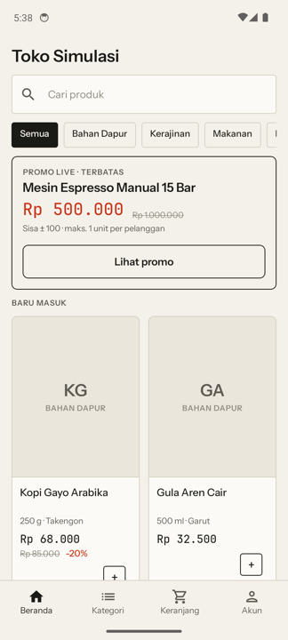
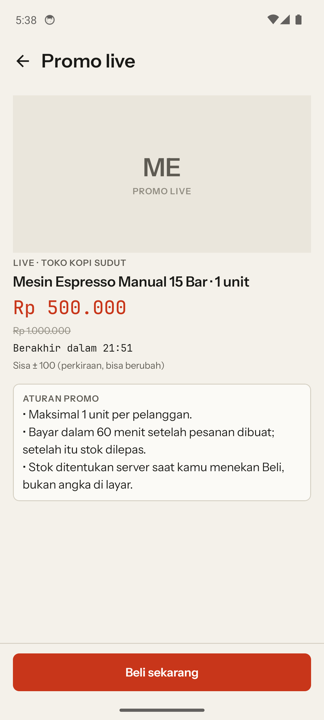
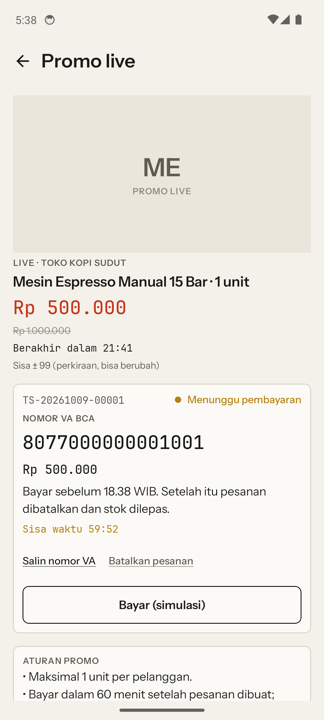
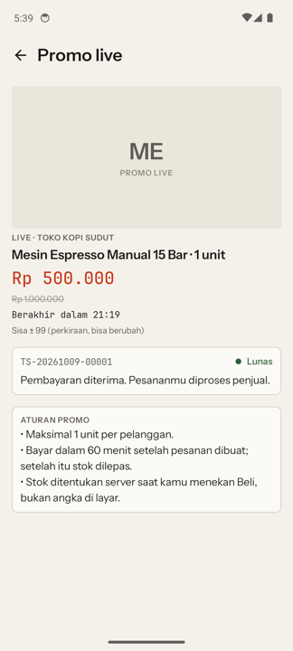
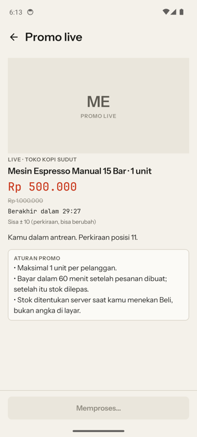

# Technical Logic Test — Studi Kasus Live Commerce (Oversell Stok Promo)

Jawaban tertulis **dan** simulasi yang bisa dijalankan untuk studi kasus oversell pada sesi live commerce: server Ktor dengan database SQL yang menegakkan invariant, plus aplikasi Android (Jetpack Compose) sebagai klien.

| Bagian | Isi |
|---|---|
| [Soal](#soal) | Studi kasus asli |
| [1. Analisis insiden](#1-analisis-insiden) | Akar masalah, faktor pemicu, mitigasi, jawaban "berhenti di 200?" |
| [2. Alur pembelian yang seharusnya](#2-alur-pembelian-yang-seharusnya) | Flow, SQL atomik, state machine, kegagalan VA |
| [3. Desain ulang arsitektur](#3-desain-ulang-arsitektur) | Arsitektur target, prioritas P0–P2 |
| [Bukti dari simulasi](#bukti-dari-simulasi) | Hasil beban 250.000 pembeli di H2 dan **MySQL 8**, 35 test server + 7 test Android, screenshot emulator |
| [Fitur penanganan insiden](#fitur-penanganan-insiden-yang-diimplementasikan) | Waiting room, harga normal, 800 penjual, kompensasi massal, alert |
| [Menjalankan](#menjalankan) | Server, reproduksi insiden, aplikasi Android |
| [Batasan dan deviasi](#batasan-dan-deviasi-dari-kasus) | Yang belum dibuat / berbeda dari kasus, ditulis apa adanya |
| [Struktur proyek](#struktur-proyek) | Peta repo dan dokumen pendukung |

---

## Soal

Seorang penjual menawarkan **100 unit** seharga **Rp500.000** selama sesi live **20.00–20.30 WIB**; setelah itu harga kembali **Rp1.000.000**. Ia punya **250 unit** lain di gudang untuk harga normal. Sekitar **250.000 penonton** mencoba membeli antara 20.15 dan 20.30. Setiap pelanggan maksimal satu unit; aplikasi menampilkan nomor **virtual account (VA)** yang berlaku **24 jam**.

Keesokan harinya pukul 09.00, penjual melapor **150 pembayaran promo (Rp75 juta)** padahal hanya 100 unit yang ditawarkan, dan meminta platform menanggung selisih **Rp25 juta**. **800 penjual lain** mengalami hal sama. Pukul 12.00 jumlahnya menjadi **200 pembayaran** (kelebihan 100 unit, tuntutan Rp50 juta) dan engineering tidak bisa menjamin angkanya berhenti.

**Proses backend saat ini:** (1) baca sisa stok dari MySQL, jika > 0 lanjut; (2) sebelum membuat VA, kurangi stok 1 unit dan tulis ke MySQL; (3) jika pembuatan VA gagal, tambahkan kembali 1 unit. Tim memastikan tidak ada kegagalan VA, sehingga langkah 3 tidak pernah jalan.

**Pertanyaan**
1. Bagaimana analisis Anda atas insiden ini?
2. Menurut Anda, bagaimana proses pembelian seharusnya berjalan di dalam sistem?
3. Jika diberi keleluasaan penuh mendesain ulang arsitektur sistem dan aplikasi, apa yang Anda usulkan agar insiden tidak terulang?

Angka dasar yang dipakai:
- Selisih per unit = Rp1.000.000 − Rp500.000 = **Rp500.000**. 50 unit lebih = Rp25 juta, 100 unit lebih = Rp50 juta; eksposur naik linear dengan tiap pembayaran ekstra.
- 250.000 request dalam 15 menit ≈ **280 request/detik rata-rata**, dengan puncak jauh lebih tinggi di menit-menit awal, dan semuanya menyasar **satu baris stok** (hot row).
- "150 dibayar" hanyalah **batas bawah**: yang diterbitkan adalah VA, bukan pembayaran. VA yang belum dibayar masih sah sampai 20.30 hari berikutnya.

---

## 1. Analisis insiden

### Akar masalah: check-then-act yang tidak atomik (lost update)

Backend melakukan tiga langkah terpisah: **baca** stok → **putuskan** lanjut bila `stok > 0` → **tulis** stok baru. Di bawah konkurensi, banyak request membaca nilai yang sama, semuanya lolos pengecekan, lalu saling menimpa tulisan. Stok turun jauh lebih sedikit daripada jumlah VA yang terbit.



Klaim "rollback langkah 3 tidak pernah berjalan" benar tetapi **tidak relevan**: ia hanya menyingkirkan satu hipotesis (stok dikembalikan karena VA gagal), bukan penyebab utama. Penyebabnya ada di langkah 1–2.

### Faktor yang memperparah

| # | Faktor | Dampak |
|---|---|---|
| 1 | Tidak ada invariant di database (`reserved + sold <= allocation`) | Kode yang salah dibiarkan menembus |
| 2 | Satu baris stok menerima seluruh trafik | Kontensi tinggi → timeout dan retry → jendela race makin lebar |
| 3 | VA berlaku 24 jam | Eksposur terbuka jauh setelah sesi selesai |
| 4 | Tidak ada reservasi dengan TTL dan kepemilikan stok per order | Tidak bisa tahu order mana yang "sah" |
| 5 | Harga promo mengikuti sesi, tidak di-snapshot ke order | Sulit membuktikan harga mana yang berlaku |
| 6 | Tidak ada idempotency key | Tap ganda / retry klien bisa membuat order ganda |
| 7 | Tidak ada monitor invariant atau alert | Diketahui dari telepon penjual 12 jam kemudian |
| 8 | Tidak ada kill switch per kampanye | Tidak bisa menghentikan dampak dalam detik |
| 9 | Tidak ada concurrency/load test sebagai syarat rilis | Bug hanya muncul di produksi |
| 10 | Tidak ada runbook dan syarat promo eksplisit | Kompensasi diputuskan ad-hoc lewat telepon |

### Mitigasi segera (urutan eksekusi)

1. **Hentikan sumber pendarahan** — matikan penerbitan VA promo lewat kill switch di **backend** (bukan hanya menyembunyikan di aplikasi), lalu pastikan request yang sedang berjalan dan job tertunda ikut berhenti.
2. **Ukur eksposur** — rekonsiliasi order, VA, dan status pembayaran dengan penyedia pembayaran untuk **seluruh** penjual terdampak. Kelompokkan: `dibayar`, `VA belum dibayar`, `status tidak pasti`. Hitung per kampanye: `order_aktif − alokasi`.
3. **Bekukan jumlah** — VA belum dibayar untuk kampanye ber-oversell dinonaktifkan di sisi gateway, atau callback-nya ditahan sampai kebijakan diputuskan.
4. **Hubungi penjual secara proaktif**, jangan menunggu 800 penjual menelepon satu per satu.

### Menjawab penjual: "Ada jaminan berhenti di 200?"

Jawaban yang benar adalah **mekanisme**, bukan angka:

> "Mulai pukul X semua VA promo untuk kampanye Anda sudah dikunci sehingga tidak ada pembayaran baru yang diterima. Jumlah final 200 pembayaran, dan kami menyiapkan opsi penyelesaian."

Angka final tidak boleh disebut sebelum langkah 3 benar-benar terverifikasi di sisi gateway.

### Opsi penyelesaian order di atas alokasi

Keputusan ini milik bisnis, keuangan, dan legal; engineering menyiapkan datanya.

| Opsi | Ringkas | Plus | Minus |
|---|---|---|---|
| A. Penuhi semua | Penjual kirim, platform menanggung selisih Rp500.000 × kelebihan | Pelanggan puas, tidak ada ulasan bintang satu | Biaya langsung; 800 penjual lain berpotensi menuntut hal sama |
| B. Penuhi N pertama, refund sisanya | Urut waktu reservasi/pembayaran; sisanya refund penuh + voucher | Biaya terkontrol, adil secara prosedur | Pelanggan yang di-refund kecewa |
| C. Campuran | Penuhi sebagian atas kesediaan penjual, sisanya refund + voucher | Fleksibel | Rumit dioperasikan untuk 800 penjual |

Rekomendasi teknis: siapkan skrip yang menghasilkan daftar `order_id` terurut (`reserved_at`, lalu `paid_at`) beserta keputusan A/B/C per order, sehingga apa pun keputusannya bisa dieksekusi massal dan teraudit. Kompensasi tidak boleh dihitung manual per telepon.

---

## 2. Alur pembelian yang seharusnya

### Prinsip

1. **Satu otoritas stok: MySQL.** Redis/cache hanya untuk tampilan dan rate limiting, tidak pernah menentukan "terjual".
2. **Alokasi atomik** — keputusan = `affected_rows` dari satu `UPDATE` bersyarat, bukan hasil bacaan sebelumnya.
3. **Invariant di database** — `CHECK (reserved + sold <= allocation)` sebagai jaring pengaman terakhir.
4. **Reservasi + order + ledger dalam satu transaksi singkat** agar tidak ada reservasi yatim.
5. **Panggilan gateway di luar transaksi** dan tidak pernah memegang lock baris stok.
6. **Idempoten di semua titik**: pembelian, pembuatan VA, callback, pelepasan reservasi.
7. **Harga di-snapshot ke order** saat reservasi, memakai jam server.
8. **Tampilan stok di klien hanya petunjuk**, bukan jaminan.

### Alokasi atomik

```sql
START TRANSACTION;

UPDATE campaign
   SET reserved = reserved + 1
 WHERE id = ? AND status = 'ACTIVE'
   AND NOW(3) >= starts_at AND NOW(3) < ends_at
   AND reserved + sold < allocation;
-- affected_rows = 0  -> ROLLBACK, jawab SOLD_OUT / CAMPAIGN_NOT_ACTIVE, TIDAK ada VA

INSERT INTO orders (..., unit_price, idempotency_key, status, reserved_until)
VALUES (..., promo_price_snapshot, ?, 'PENDING_PAYMENT', NOW(3) + INTERVAL ? SECOND);
-- duplicate key (user,campaign) / idempotency_key -> ROLLBACK, kembalikan order yang ada

INSERT INTO inventory_ledger (order_id, entry_type) VALUES (?, 'RESERVE');
COMMIT;
```

### Flow lengkap



### State machine order



### Aturan turunan

| Topik | Aturan |
|---|---|
| 1 unit per pelanggan | `UNIQUE (user_id, campaign_id, active_key)`; `active_key = 1` hanya untuk status `PENDING_PAYMENT/PAID/FULFILLED` (NULL selainnya), sehingga pelanggan boleh membeli lagi setelah ordernya kedaluwarsa |
| Kegagalan VA | Transaksi DB tidak mencakup gateway. Gagal pasti → lepas reservasi via `inventory_ledger` (`UNIQUE(order_id, entry_type)`); timeout → cek status VA dulu, jangan terbitkan VA kedua |
| TTL reservasi | VA flash sale dibuat kedaluwarsa pada `reserved_until` (default 60 menit) |
| Pembayaran terlambat | Setelah order `EXPIRED`: dipulihkan bila alokasi masih ada, selain itu `REFUND_REQUIRED` → refund otomatis |
| Callback | Verifikasi HMAC, dedup `provider_event_id`, lalu transisi status **compare-and-set** agar callback dan worker kedaluwarsa tidak berebut |
| Jam | Seluruh keputusan waktu memakai jam server DB, bukan jam klien |
| Harga | `unit_price` di-snapshot saat reservasi; pembayaran setelah 20.30 tetap memakai harga snapshot selama order belum kedaluwarsa |

---

## 3. Desain ulang arsitektur

Tantangannya bukan sekadar 250.000 pengguna, melainkan **lonjakan request, konsistensi alokasi, dan integrasi pembayaran**. MySQL menjadi satu-satunya otoritas stok; Redis untuk rate limit/cache; worker rekonsiliasi dan monitor invariant sebagai jaring pengaman; kill switch per kampanye.



| Level | Solusi | Tujuan |
|---|---|---|
| P0 | Conditional update atomik + `CHECK` constraint | Mencegah oversell |
| P0 | Kill switch per kampanye (di backend) | Menghentikan dampak dalam detik |
| P0 | Idempotency key + rekonsiliasi pembayaran | Mencegah duplikasi, menangani status ambigu |
| P0 | Alert: `reserved + sold > allocation` atau `order_aktif > allocation` | Deteksi dalam menit, bukan 12 jam |
| P1 | Reservasi TTL + worker kedaluwarsa + VA expiry selaras | Mengelola stok belum dibayar |
| P1 | Waiting room, rate limit per user/IP/device | Meredam lonjakan trafik |
| P1 | Pembatalan massal VA di gateway | Membekukan eksposur saat insiden |
| P2 | Redis cache, CDC, data warehouse, sharded counter | Optimasi bila terbukti perlu |

**Tentang hot row.** Untuk 100 unit, hampir semua request ditolak cepat: `UPDATE` tidak mengenai baris (`affected_rows = 0`) begitu alokasi habis. Pencegahan terbaik adalah *admission control* (waiting room meloloskan ±3–5× alokasi, sisanya langsung "stok habis" tanpa menyentuh MySQL). Bila alokasi besar dan kontensi terbukti jadi masalah, pecah alokasi menjadi N slot counter; invariantnya tetap `SUM(slot.allocation)`.

**Syarat rilis fitur flash sale:** concurrency test (≥5.000 request paralel pada alokasi 100 → tepat 100 order aktif), load test ≥3× puncak termasuk gateway timeout, chaos test callback ganda/terlambat, runbook insiden, dan syarat promo yang eksplisit (alokasi, 1 per akun, TTL bayar, hak platform membatalkan order di atas alokasi).

**Di sisi aplikasi:** satu `Idempotency-Key` per niat beli (disimpan sampai hasil final); retry memakai key yang sama; tombol Beli dinonaktifkan saat memproses tetapi server tetap idempoten; countdown memakai waktu server; angka stok ditampilkan sebagai "perkiraan"; hasil dipetakan ke `PurchaseResult` (Reserved / SoldOut / AlreadyPurchased / CampaignNotActive / RateLimited / Unknown / Failure).

---

## Bukti dari simulasi

Semua angka di bawah dihasilkan dari kode di repo ini, bukan estimasi.

### Reproduksi insiden — 250.000 pembeli virtual, alokasi 100

| Mode | Database | Diterima / VA terbit | Oversell | Durasi |
|---|---|---:|---:|---:|
| Alur lama (baca → tulis) | H2 | **18.409** | **18.309** | 4,7 dtk |
| Alur lama (baca → tulis) | **MySQL 8.0.46** | **15.393** | **15.293** | 57,6 dtk |
| Alur baru (UPDATE bersyarat atomik) | H2 | **100** | **0** | 3,8 dtk |
| Alur baru (UPDATE bersyarat atomik) | **MySQL 8.0.46** | **100** | **0** | 112,9 dtk |
| Alur baru + waiting room (5× alokasi) | MySQL 8.0.46 | **100** | **0** | **1,6 dtk** (249.500 pembeli tidak menyentuh DB) |

Pada alur lama, counter stok di database hanya turun sedikit padahal belasan ribu VA terbit — gejala yang sama dengan kasus. Tanpa waiting room, 250.000 pembeli menghantam satu baris stok dan memakan ~113 detik di MySQL; dengan admission control, hot row nyaris tidak tersentuh (±70× lebih cepat). Alur baru tidak pernah melewati 100, di kedua database.

### Test otomatis

| Suite | Jumlah | Hasil |
|---|---:|---|
| Server di H2 (`./gradlew :server:test`) | 35 | semua lulus |
| **Server di MySQL 8** (`MYSQL_URL=... ./gradlew :server:test --rerun`) | 35 | **semua lulus** (seluruh suite yang sama) |
| Android JVM (`./gradlew :app:testDebugUnitTest`) | 7 | semua lulus |

Cakupan penting:
- 5.000 pembeli paralel pada alokasi 100 → tepat 100 order aktif, 4.900 `SOLD_OUT`.
- **3.000 pembeli lewat HTTP asli (Netty) dengan gateway gagal 30%** → tetap tepat 100 order, tepat 100 VA (tanpa VA ganda), invariant bersih (H2 ±1.100 req/dtk, MySQL ±1.100–1.900 req/dtk di laptop).
- Idempotency key, satu pelanggan satu order aktif, kedaluwarsa melepas stok, pelepasan idempoten dengan 8 worker paralel.
- Callback ganda, tanda tangan salah, callback hilang (diperbaiki rekonsiliasi), bayar terlambat (dipulihkan atau di-refund).
- Gateway gagal pasti → reservasi dilepas dan **retry dengan key yang sama membuat reservasi baru** (bug ini ketahuan saat menulis test, lalu diperbaiki).
- `CHECK` menolak oversell walau kode salah; monitor menjeda kampanye otomatis dan **mengirim alert ke webhook**.
- 300 pembeli paralel untuk 250 unit gudang → tepat 250 sukses, stok tidak minus, harga Rp1.000.000.
- Eksposur 800 penjual, rencana kompensasi A/B/C, eksekusi idempoten, pembekuan massal.
- Android: retry memakai `Idempotency-Key` yang sama (503, koneksi putus, checkout), key dibuang hanya setelah hasil final, 202 antrean dan 429 mempertahankan key.

Status audit per poin ada di [`docs/audit.md`](docs/audit.md) (INV-01 s/d INV-14).

### Aplikasi di emulator (Android 14, arm64)

| Beranda | Promo live | VA + hitung mundur | Lunas | Antrean |
|:--:|:--:|:--:|:--:|:--:|
|  |  |  |  |  |

Alur Beli → VA → Bayar (simulasi) → Lunas dijalankan sungguhan terhadap server; setelahnya rekonsiliasi server menunjukkan `sold=1`, `PAID=1`, tanpa pelanggaran invariant. Layar "Antrean" muncul saat pembeli di luar kuota waiting room menekan Beli.

---

## Fitur penanganan insiden yang diimplementasikan

| Fitur | Endpoint / lokasi |
|---|---|
| **Waiting room** (5× alokasi lolos, tiap reservasi dilepas membuka 5 slot) | `POST /campaigns/{id}/purchase` → `202`, `GET /queue/{ticket}` — `Admission.kt` |
| **Harga normal untuk 250 unit gudang** (stok atomik, tanpa minus) | Produk `Mesin Espresso` di katalog Rp1.000.000, `POST /checkout` |
| **Banyak penjual** (800 kampanye) | `POST /sim/campaigns`, `POST /sim/incident?campaigns=800&users=500` |
| **Eksposur lintas penjual** | `GET /admin/incident/exposure` |
| **Pembekuan massal**: jeda semua kampanye + batalkan semua VA belum dibayar di gateway | `POST /admin/incident/freeze-all` |
| **Rencana & eksekusi kompensasi massal** opsi A/B/C (idempoten, teraudit di tabel `compensations`) | `GET /admin/campaigns/{id}/compensation-plan?option=A\|B\|C`, `POST .../compensation-execute` |
| **Alert on-call** via webhook (`ALERT_WEBHOOK_URL`) + log | `Alerter.kt`, `Workers.monitorOnce` |
| Gateway tidak stabil (gagal pasti + timeout acak) | `POST /sim/gateway?mode=flaky&rate=0.3` |
| Urutan lock konsisten `campaign → orders` (mencegah deadlock di MySQL) | `Inventory.lockCampaign` |

Hasil drill pada 800 penjual (masing-masing 500 pembeli, alur lama, MySQL): **800 kampanye terdampak, 320.000 VA/order melebihi alokasi, kerugian bila semua dipenuhi di harga promo Rp160 miliar**. Untuk satu kampanye (400 kelebihan, 320 sudah dibayar):

| Opsi | Subsidi platform | Refund | Voucher | Biaya platform |
|---|---:|---:|---:|---:|
| A. Penuhi semua | Rp160.000.000 | – | – | **Rp160.000.000** |
| B. Refund + voucher | – | Rp160.000.000 | Rp16.000.000 | **Rp16.000.000** |
| C. Campuran (50% penjual bersedia) | Rp80.000.000 | Rp80.000.000 | Rp8.000.000 | **Rp88.000.000** |

(80 VA belum dibayar dibatalkan di gateway tanpa biaya. Nilai voucher Rp50.000 per pelanggan adalah parameter, bukan keputusan.) `freeze-all` menjeda 801 kampanye; eksekusi opsi B menulis 720 baris kompensasi pada pemanggilan pertama dan **0** pada pemanggilan kedua (idempoten).

---

## Menjalankan

Butuh JDK 17+ (Android Studio menyertakan JBR):
```bash
export JAVA_HOME="/Applications/Android Studio.app/Contents/jbr/Contents/Home"
```

**Server (Ktor + H2 mode MySQL), port 8080**
```bash
./gradlew :server:run
./gradlew :server:test        # H2 (35 test)
```

**Reproduksi insiden**
```bash
curl -X POST "localhost:8080/sim/reset?allocation=100"
curl -X POST "localhost:8080/sim/load?mode=legacy&users=250000"   # alur lama: oversell
curl -X POST "localhost:8080/sim/reset?allocation=100"
curl -X POST "localhost:8080/sim/load?mode=safe&users=250000"     # alur baru: tepat 100
```

**Verifikasi di MySQL 8 (Docker)**
```bash
docker run -d --name toko-mysql -e MYSQL_ALLOW_EMPTY_PASSWORD=yes -e MYSQL_DATABASE=shop -p 3307:3306 \
  mysql:8.0 --max-connections=300 --default-time-zone=+00:00
export MYSQL_URL=jdbc:mysql://localhost:3307/shop MYSQL_USER=root     # kontainer lokal sekali pakai, tanpa password
./gradlew :server:test --rerun        # seluruh suite yang sama dijalankan terhadap MySQL
./gradlew :server:run                  # server memakai MySQL bila MYSQL_URL diset
```

**Drill insiden 800 penjual dan kompensasi**
```bash
curl -X POST "localhost:8080/sim/incident?campaigns=800&users=500"
curl localhost:8080/admin/incident/exposure
curl -X POST localhost:8080/admin/incident/freeze-all
curl "localhost:8080/admin/campaigns/2/compensation-plan?option=C&seller_pct=50"
curl -X POST "localhost:8080/admin/campaigns/2/compensation-execute?option=B"
```

**Mencoba satu pembeli lewat curl**
```bash
curl -X POST localhost:8080/campaigns/1/purchase -H 'Authorization: Bearer demo-1' \
     -H 'Idempotency-Key: abc' -d '{"quantity":1}'          # 201, kirim ulang -> 200
curl -X POST "localhost:8080/sim/payments/<order_id>/pay?behavior=duplicate"
curl -X POST localhost:8080/admin/campaigns/1/pause          # kill switch
curl localhost:8080/admin/campaigns/1/reconciliation
```
Perilaku gateway tiruan: `behavior=ok|duplicate|late|lost`, dan `POST /sim/gateway?mode=ok|fail|timeout|flaky&rate=0.3`.

**Aplikasi Android** — buka di Android Studio lalu *Run 'app'*, atau `./gradlew :app:assembleDebug`. Emulator memakai `http://10.0.2.2:8080`; HP fisik: `adb reverse tcp:8080 tcp:8080` lalu ubah alamat server di tab Akun. Di tab Akun ID pengguna demo bisa diganti untuk mencoba beberapa pembeli pada promo yang sama. Unit test Android: `./gradlew :app:testDebugUnitTest`.

---

## Batasan dan deviasi dari kasus

Ditulis apa adanya supaya tidak ada klaim yang melebihi bukti.

- **VA 60 menit, bukan 24 jam.** Di kasus VA berlaku 24 jam; saya persingkat sebagai *usulan perbaikan* untuk memperkecil eksposur. Ini keputusan bisnis dan mudah dikembalikan (`payment_window_sec`).
- **MySQL 8 diuji lewat Docker satu node di laptop**, bukan klaster produksi: tanpa replika, tanpa tuning, tanpa failover. Hasil durasi (mis. 113 detik untuk 250.000 pembeli tanpa waiting room) bukan patokan kapasitas produksi.
- **Redis tidak dipakai.** Rate limit, cache "stok habis", dan admission control berjalan di memori satu proses; pada banyak instance perlu dipindah ke Redis atau gateway. Ini sengaja ditinggalkan karena MySQL tetap satu-satunya otoritas stok.
- **Alert** terbukti sampai ke endpoint webhook (diuji dengan penerima lokal), tetapi belum tersambung ke layanan on-call sungguhan.
- **Uji beban 250.000 berjalan in-process** (langsung ke layanan); uji lewat HTTP asli baru 3.000 pembeli (±1.100–1.900 req/dtk di laptop), belum pada ≥3× puncak sebenarnya.
- **Kompensasi massal** mencatat keputusan, subsidi, refund, dan voucher secara idempoten, tetapi tidak menggerakkan uang sungguhan; angka voucher dan persentase kesediaan penjual hanyalah parameter.
- **Test Android hanya JVM unit test** (7). Belum ada uji UI otomatis (Compose/instrumented); tampilan diverifikasi manual lewat emulator dan screenshot.
- **CI** (`.github/workflows/ci.yml`: server H2 dan Android unit) ditulis tetapi belum pernah dijalankan di GitHub. Suite MySQL 8 dijalankan manual lewat Docker (lihat *Menjalankan*), belum otomatis di CI.
- Auth disederhanakan (`Authorization: Bearer demo-<userId>`); iOS tidak dibuat; tidak ada uang sungguhan.

---

## Struktur proyek

```
.
├── server/                    # Backend simulasi (Ktor + H2): inventori atomik, gateway tiruan, beban, test
│   └── src/main/resources/schema.sql   # DDL: CHECK, UNIQUE, ledger, audit
├── app/                       # Aplikasi Android (Compose, OkHttp): toko lengkap + promo live
├── DESIGN.md                  # Sistem desain UI ("Struk & Rak Toko")
├── .github/workflows/ci.yml   # CI: server H2, Android unit
├── docs/
│   ├── incident-live-commerce.md   # Post-mortem lengkap (sumber README ini)
│   ├── screenshots/                # Tangkapan layar emulator
│   ├── backend.md  api.md  database.md
│   ├── requirements.md  audit.md  frontend.md  uiux.md  deployment.md
├── .agents/  .ai-context/     # Panduan agent AI untuk proyek
└── gradlew  settings.gradle.kts
```
