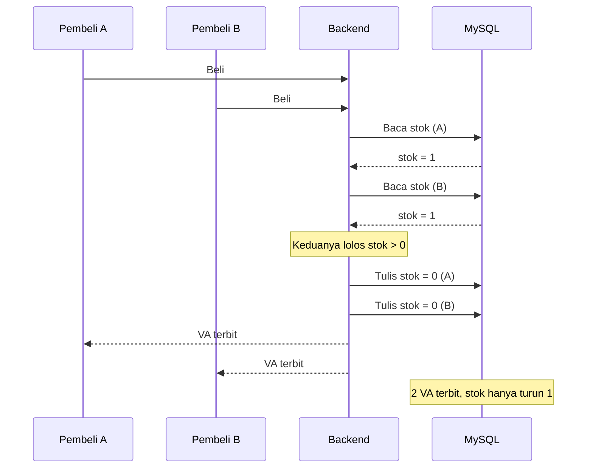
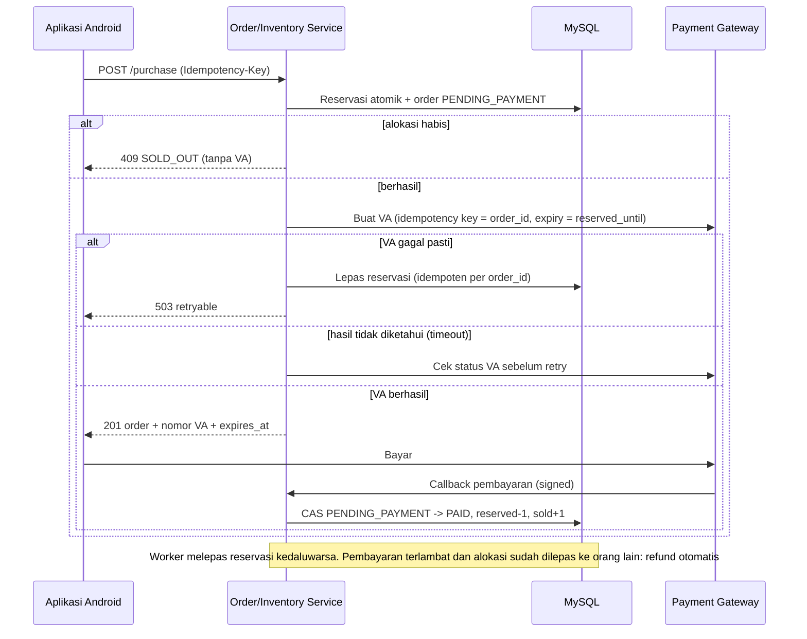
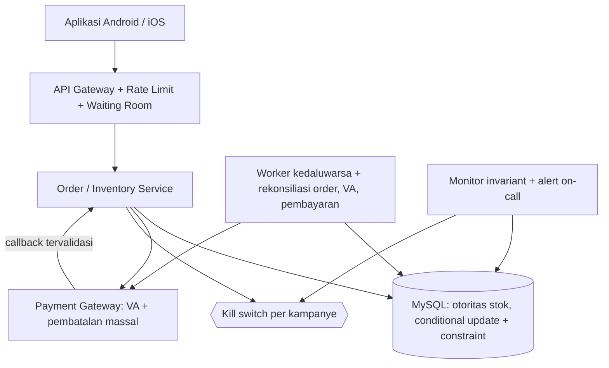

# Post-Mortem: Oversell Stok Promo pada Sesi Live Commerce

> Studi kasus yang menjadi dasar desain backend proyek ini. Aturan yang lahir dari insiden ini ditulis sebagai kontrak di [`backend.md`](backend.md), [`api.md`](api.md), [`database.md`](database.md), dan dicek di [`audit.md`](audit.md).

## 0. Fakta Kasus

| Item | Nilai |
|---|---|
| Alokasi promo | 100 unit @ Rp500.000 (normal Rp1.000.000), sesi 20.00–20.30 WIB |
| Stok gudang lain | 250 unit @ harga normal |
| Penonton aktif | ± 250.000, mencoba beli 20.15–20.30 (15 menit) |
| Aturan bisnis | 1 unit per pelanggan, VA berlaku 24 jam |
| Hasil 09.00 | 150 pembayaran promo (Rp75 juta), 50 melebihi alokasi, tuntutan Rp25 juta |
| Hasil 12.00 | 200 pembayaran promo, 100 melebihi alokasi, tuntutan Rp50 juta |
| Skala masalah | +800 penjual lain terdampak, belum melapor |
| Status | Engineering tidak bisa menjamin jumlah berhenti |

Hitungan dasar yang perlu diketahui:
- Selisih per unit = Rp1.000.000 − Rp500.000 = **Rp500.000**. 50 unit = Rp25 juta, 100 unit = Rp50 juta. Eksposur bertambah linear dengan setiap pembayaran ekstra.
- 250.000 request dalam 15 menit ≈ **280 request/detik rata-rata**, dengan puncak jauh lebih tinggi di menit-menit pertama. Seluruhnya menyasar **satu baris stok** (hot row).
- Angka "150 dibayar" adalah **batas bawah** eksposur. Yang diterbitkan adalah VA, bukan pembayaran; VA yang belum dibayar masih sah sampai 20.30 hari berikutnya.

---

## 1. Analisis Insiden

### 1.1 Akar masalah: check-then-act yang tidak atomik

Backend melakukan tiga langkah terpisah: baca stok → putuskan lanjut jika `stok > 0` → tulis stok baru. Di bawah konkurensi, banyak request membaca nilai yang sama, semuanya lolos, dan penulisan saling menimpa (**lost update**). Stok turun jauh lebih sedikit daripada jumlah VA yang terbit.



Klaim "rollback langkah #3 tidak pernah jalan" benar, tetapi **tidak relevan**: ia hanya menyingkirkan satu hipotesis (stok dikembalikan karena VA gagal). Penyebab utama ada di langkah 1–2.

### 1.2 Faktor yang memperparah

| # | Faktor | Dampak |
|---|---|---|
| 1 | Tidak ada invariant di database (`reserved + sold <= allocation`) | Kode salah dibiarkan menembus |
| 2 | Satu baris stok menerima seluruh trafik | Kontensi tinggi, memicu timeout, retry, dan membesarkan jendela race |
| 3 | VA berlaku 24 jam | Eksposur masih terbuka jauh setelah sesi selesai |
| 4 | Tidak ada reservasi dengan TTL dan tidak ada kepemilikan stok per order | Tidak bisa tahu order mana yang "sah" |
| 5 | Harga promo ditentukan oleh sesi, bukan di-snapshot ke order | Sulit membuktikan harga mana yang berlaku |
| 6 | Tidak ada idempotency key | Retry klien (tap ganda, timeout) bisa membuat order ganda |
| 7 | Tidak ada monitor invariant atau alert | Insiden diketahui dari telepon penjual, 12 jam kemudian |
| 8 | Tidak ada kill switch per kampanye | Tidak bisa menghentikan dampak dalam hitungan detik |
| 9 | Tidak ada load/concurrency test sebagai syarat rilis | Bug hanya muncul di produksi |
| 10 | Tidak ada runbook dan syarat promo yang eksplisit | Keputusan kompensasi dibuat ad-hoc lewat telepon |

### 1.3 Mitigasi segera (urutan eksekusi)

1. **Hentikan sumber pendarahan.** Matikan penerbitan VA promo lewat kill switch di backend (bukan hanya menyembunyikan di aplikasi), lalu pastikan request yang sedang berjalan dan job tertunda ikut berhenti.
2. **Ukur eksposur.** Rekonsiliasi order, VA, dan status pembayaran dengan penyedia pembayaran untuk **seluruh** penjual terdampak. Kelompokkan: `dibayar`, `VA belum dibayar`, `status tidak pasti`. Hitung per kampanye: `jumlah_order_aktif − alokasi`.
3. **Bekukan jumlah.** Agar angka tidak bertambah, VA promo yang belum dibayar untuk kampanye ber-oversell dinonaktifkan/dikunci di sisi gateway, atau callback-nya ditahan (hold) sampai kebijakan diputuskan. Inilah satu-satunya cara yang jujur untuk menjawab "ada jaminan berhenti di 200?".
4. **Hubungi penjual secara proaktif**, jangan menunggu 800 penjual menelepon satu per satu.

### 1.4 Menjawab pertanyaan penjual: "Berhenti di 200?"

Jawaban yang benar bukan angka, melainkan **mekanisme**:

> "Mulai pukul X, kami sudah mengunci semua VA promo untuk kampanye Anda sehingga tidak ada pembayaran baru yang diterima. Jumlah final adalah 200 pembayaran, dan kami sedang menyiapkan opsi penyelesaian."

Jangan menyebut angka final sebelum langkah 3 benar-benar terverifikasi di sisi gateway.

### 1.5 Opsi penyelesaian untuk order yang melebihi alokasi

Keputusan ini milik bisnis, keuangan, dan legal. Engineering menyiapkan datanya.

| Opsi | Ringkas | Plus | Minus |
|---|---|---|---|
| A. Penuhi semua | Penjual kirim, platform menanggung selisih (Rp500.000 × kelebihan) | Pelanggan puas, tidak ada ulasan buruk | Biaya langsung; 800 penjual lain berpotensi menuntut hal sama |
| B. Penuhi N pertama, refund sisanya | Urut berdasarkan waktu reservasi/pembayaran; sisanya refund penuh + voucher kompensasi | Biaya terkontrol, adil secara prosedur | Pelanggan yang di-refund kecewa |
| C. Campuran | Penuhi sebagian atas kesediaan penjual, sisanya refund + voucher | Fleksibel | Rumit untuk dioperasikan di 800 penjual |

Rekomendasi teknis: siapkan skrip yang menghasilkan daftar `order_id` terurut (`reserved_at`, lalu `paid_at`) beserta keputusan A/B/C per order, supaya apa pun yang diputuskan bisa dieksekusi secara massal dan teraudit. **Kompensasi tidak boleh dibayar dari perhitungan manual per telepon.**

---

## 2. Alur Pembelian yang Seharusnya

### 2.1 Prinsip

1. **Satu otoritas stok: MySQL.** Redis/cache hanya untuk tampilan dan rate limiting, tidak pernah menjadi penentu "terjual".
2. **Alokasi atomik.** Satu `UPDATE` bersyarat; jumlah baris terpengaruh adalah keputusan, bukan hasil bacaan sebelumnya.
3. **Invariant di database.** `CHECK (reserved + sold <= allocation)` sebagai jaring pengaman terakhir.
4. **Reservasi dan order dalam satu transaksi** agar tidak ada reservasi yatim.
5. **Panggilan eksternal (gateway pembayaran) di luar transaksi** dan tidak pernah memegang lock baris stok.
6. **Idempotent di semua titik**: pembelian, pembuatan VA, callback, pelepasan reservasi.
7. **Harga di-snapshot ke order** pada saat reservasi, memakai jam server.
8. **Tampilan stok di klien hanyalah petunjuk**, bukan jaminan.

### 2.2 Alokasi atomik

```sql
START TRANSACTION;

UPDATE campaign
   SET reserved = reserved + 1
 WHERE id = ?
   AND status = 'ACTIVE'
   AND NOW(3) >= starts_at AND NOW(3) < ends_at
   AND reserved + sold < allocation;
-- affected_rows = 0  -> ROLLBACK, jawab SOLD_OUT / CAMPAIGN_NOT_ACTIVE, TIDAK ada VA

INSERT INTO orders (..., unit_price, idempotency_key, status, reserved_until)
VALUES (..., promo_price_snapshot, ?, 'PENDING_PAYMENT', NOW(3) + INTERVAL ? SECOND);
-- duplicate key (user, campaign) / idempotency_key -> ROLLBACK, kembalikan order yang sudah ada

INSERT INTO inventory_ledger (order_id, entry_type, qty) VALUES (?, 'RESERVE', 1);

COMMIT;
```

### 2.3 Alur lengkap



### 2.4 Aturan turunan

| Topik | Aturan |
|---|---|
| 1 unit per pelanggan | `UNIQUE (user_id, campaign_id, active_key)` di tabel `orders`; `active_key = 1` hanya untuk status `PENDING_PAYMENT`/`PAID` (NULL selainnya) sehingga pelanggan boleh beli lagi setelah order-nya kedaluwarsa |
| Kegagalan VA | Transaksi MySQL tidak mencakup gateway. Gagal pasti → lepas reservasi lewat `inventory_ledger` (`UNIQUE(order_id, entry_type)`); timeout → cek status VA dulu, jangan terbitkan VA kedua |
| TTL reservasi | **VA flash sale dibuat kedaluwarsa pada `reserved_until`** (default 60 menit, bukan 24 jam). Ini memperkecil jendela eksposur dan membuat stok tak terbayar kembali tersedia |
| Pembayaran terlambat | Bila callback datang setelah order `EXPIRED` dan alokasi tidak tersedia → order `REFUND_REQUIRED`, refund otomatis, notifikasi ke pelanggan |
| Callback | Verifikasi tanda tangan, cek `provider_event_id` unik, lalu transisi status dengan **compare-and-set** (`UPDATE ... WHERE status='PENDING_PAYMENT'`) agar callback dan worker kedaluwarsa tidak berebut |
| Jam | Seluruh keputusan waktu (mulai/selesai promo, TTL) memakai jam server DB, bukan jam klien |
| Harga | `unit_price` di-snapshot saat reservasi. Pembayaran yang masuk setelah 20.30 tetap memakai harga snapshot selama order belum kedaluwarsa |

---

## 3. Arsitektur dan Prioritas

MySQL dijadikan satu-satunya otoritas stok. Redis dipakai untuk rate limiting dan cache baca. Worker rekonsiliasi dan monitor invariant menjadi jaring pengaman, dengan kill switch per kampanye.



| Level | Solusi | Tujuan |
|---|---|---|
| P0 | Conditional update atomik + `CHECK` constraint | Mencegah oversell |
| P0 | Kill switch per kampanye (di backend) | Menghentikan dampak dalam detik |
| P0 | Idempotency key + rekonsiliasi pembayaran | Mencegah duplikasi, menangani status ambigu |
| P0 | Alert: `reserved + sold > allocation` atau `order_aktif > allocation` | Deteksi dalam menit, bukan 12 jam |
| P1 | Reservasi TTL + worker kedaluwarsa + VA expiry selaras | Mengelola stok belum dibayar |
| P1 | Waiting room, rate limit per user/IP/device | Meredam lonjakan trafik |
| P1 | Gateway-level bulk cancel VA | Membekukan eksposur saat insiden |
| P2 | Redis cache, CDC, data warehouse, sharded counter | Optimasi bila terbukti perlu |

### 3.1 Tentang hot row

Satu baris diperbarui ribuan kali per detik memang menjadi leher botol, tetapi untuk 100 unit **hampir semua request ditolak cepat**: `UPDATE` tidak mengenai baris (`affected_rows = 0`) begitu alokasi habis. Pencegahan terbaik adalah **admission control**: waiting room hanya meloloskan sekitar 3–5× alokasi ke tahap pembelian, sisanya langsung mendapat "stok habis" tanpa menyentuh MySQL. Jika alokasi besar (ribuan unit) dan kontensi terbukti jadi masalah, pecah alokasi menjadi N *slot* counter (`campaign_slot`) dan pilih slot acak; invariantnya tetap `SUM(slot.allocation)`.

### 3.2 Syarat rilis fitur flash sale

- Concurrency test: ≥ 5.000 request paralel pada alokasi 100 → tepat 100 order aktif, tidak lebih.
- Load test pada puncak ≥ 3× perkiraan trafik, termasuk skenario retry dan timeout gateway.
- Chaos test: gateway timeout/lambat 30%, callback ganda, callback datang terlambat.
- Runbook insiden (§1.3) dan syarat promo yang eksplisit (alokasi, 1 per akun, TTL pembayaran, hak platform membatalkan pesanan di atas alokasi).

---

## Kesimpulan

Penyebabnya adalah asumsi bahwa baca-lalu-tulis aman di bawah konkurensi. Perbaikan intinya satu operasi atomik yang dijaga constraint database; sisanya memastikan pelanggaran serupa terdeteksi dalam hitungan menit dan eksposurnya dibatasi sejak awal (TTL pendek, kill switch, rekonsiliasi).
